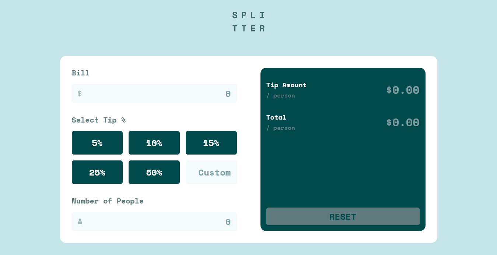

# Frontend Mentor - Tip calculator app solution

This is a solution to the [Tip calculator app challenge on Frontend Mentor](https://www.frontendmentor.io/challenges/tip-calculator-app-ugJNGbJUX). Frontend Mentor challenges help you improve your coding skills by building realistic projects.

## Table of contents

- [Overview](#overview)
  - [The challenge](#the-challenge)
  - [Screenshot](#screenshot)
  - [Links](#links)
- [My process](#my-process)
  - [Built with](#built-with)
  - [What I learned](#what-i-learned)
  - [Useful resources](#useful-resources)
- [Author](#author)

## Overview

### The challenge

Users should be able to:

- View the optimal layout for the app depending on their device's screen size
- See hover states for all interactive elements on the page
- Calculate the correct tip and total cost of the bill per person

### Screenshot

### Links

- Solution URL: [https://www.frontendmentor.io/solutions/tip-calculator-app-with-react-ntIA9KMfVc](https://www.frontendmentor.io/solutions/tip-calculator-app-with-react-ntIA9KMfVc)
- Live Site URL: [https://tip-calculator-app-with-react-alfi.vercel.app/](https://tip-calculator-app-with-react-alfi.vercel.app/)

## My process

### Built with

- Mobile-first workflow
- [React](https://reactjs.org/) – JS library for building UI
- [Tailwind CSS](https://tailwindcss.com) – CSS Framework for styling
- [Vitest](https://vitest.dev/) – unit & integration testing
- [React Testing Library](https://testing-library.com/docs/react-testing-library/intro/) – accessible testing utilities

### What I learned

While building this app I practiced not only React & Tailwind but also **writing tests**:

- **Unit tests** for components like `CalculatorInput` and `ResultSection` to ensure they render correctly and call the right callbacks when inputs change or buttons are clicked.
- **Integration tests** on the `App` component to verify the full flow: entering bill, selecting tip or custom tip, entering number of people, seeing the correct per-person tip/total, showing error messages for invalid input, and resetting the calculator back to its initial state.
- Using `getByLabelText`, `getByRole`, and `getByPlaceholderText` for more accessible and reliable queries instead of relying on test IDs.
- Verifying **disabled/enabled states** (e.g. Reset button) and active classes for selected tip buttons.

This improved my confidence in React Testing Library and how to write tests that reflect real user interactions.

### Useful resources

- [React Testing Library docs](https://testing-library.com/docs/react-testing-library/intro/) – Helped me understand how to query elements based on accessibility roles and simulate user events.
- [Vitest docs](https://vitest.dev/guide/) – Showed me how to configure Vitest for React projects and use features like `vi.fn()` and `beforeEach`.

## Author

- Website - [Muhammad Alfi Zain](https://muhammad-alfi-zain.vercel.app/)
- Frontend Mentor - [@AlfiZain](https://www.frontendmentor.io/profile/AlfiZain)
